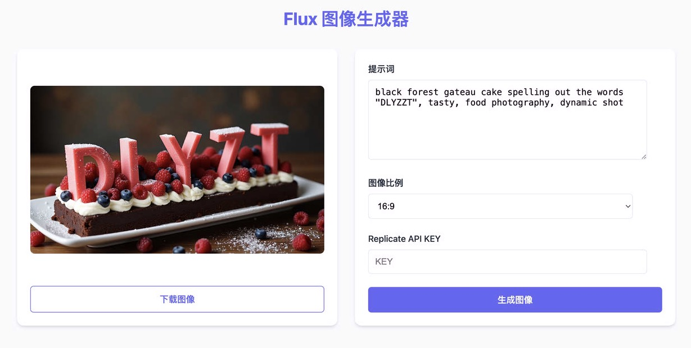

# Flux 图像生成器

这是一个基于 Cloudflare Worker 的 Web 应用程序，使用 Replicate 的 Flux Dev 模型根据文本提示词生成图像。

## 功能特点

- 现代美观的用户界面
- 左侧展示生成的图片，右侧设置控制区域
- 可自定义图片尺寸
- 图像生成完成后可直接下载

## 技术栈

- Cloudflare Workers
- HTML/CSS/JavaScript
- Replicate API

## 使用方式

1. 在 [Replicate](https://replicate.com/) 获取 API 密钥，填入API KEY
2. 在右侧输入文本提示词，描述您想要生成的图像
3. 选择图像尺寸
4. 点击"生成图像"按钮
5. 等待图像生成完成
6. 生成后可查看并下载图像

## 注意事项

- 图像生成可能需要较长时间，请耐心等待
- 为了获得更好的结果，请尝试使用详细的提示词
- 请确保您的 Replicate API 密钥有效且有足够的配额

## 许可证

MIT 